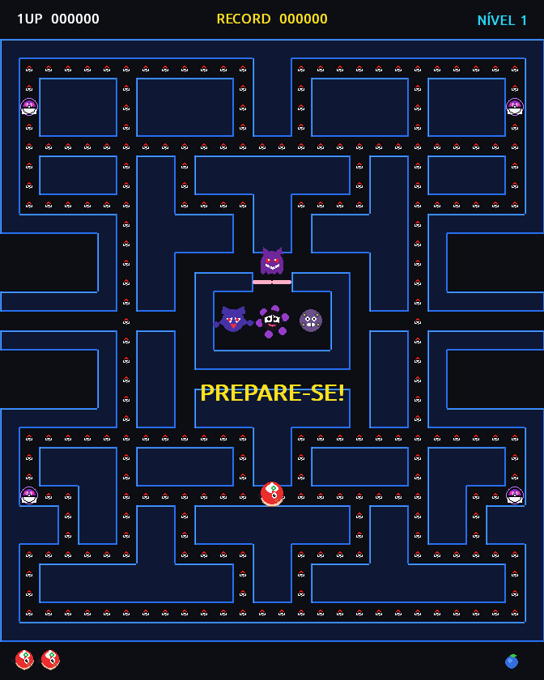
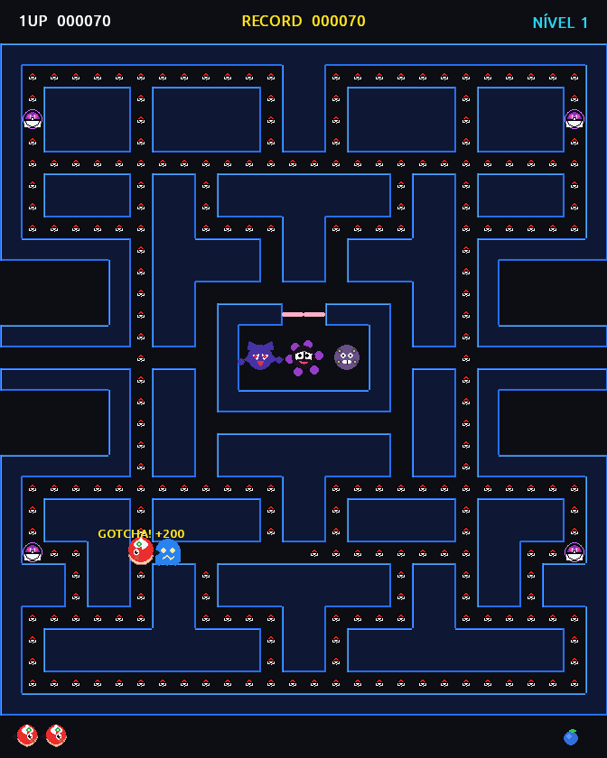

# 🧢 PokePacman — Ash Ketchum Pac-Man Edition

[](https://www.python.org/)
[](https://pyga.me/)
[](#)
[-brightgreen.svg)](#-testes-automatizados)
[](LICENSE)

O **PokePacman** é uma reimaginação completa do lendário arcade **Pac-Man (1980)** ambientado no universo clássico de **Pokémon**. O jogador controla **Ash Ketchum** em um labirinto neon inspirado na icônica Torre Fantasma de *Lavender Town*, recolhendo **Pokébolas** e **Master Balls** para fugir e capturar os 4 Pokémon fantasmas mais temidos de Kanto: **Gengar**, **Gastly**, **Haunter** e **Koffing**!

O projeto foi construído **100% em Python puro**, utilizando renderização vetorial matemática e **síntese procedural de áudio 8-bit em tempo real** — garantindo zero dependência de arquivos externos `.png`, `.wav` ou `.mp3` que possam quebrar caminhos ou licenças.

---

## 📸 Demonstração Visual do Jogo

<div align="center">
  
  
  <p><em>Esquerda: Início de fase com labirinto neon contínuo. Direita: Ash consumindo a Master Ball e capturando fantasmas com efeito GOTCHA!</em></p>
</div>

---

## 📜 História & Conceito

Ash Ketchum entrou sem querer na misteriosa Torre Fantasma e as portas se fecharam! Para escapar e se consagrar o maior Mestre Pokémon, Ash precisa limpar o labirinto recolhendo todas as Pokébolas perdidas. Mas cuidado: a Equipe Fantasma foi enviada para capturá-lo! Felizmente, as lendárias **Master Balls** foram deixadas nos quatro cantos do labirinto, permitindo que Ash vire o jogo e capture os próprios fantasmas!

---

## 🕹️ Descrição Completa das Mecânicas de Jogo

### 1. 🧢 Ash Ketchum (O Protagonista)
* **Design Procedural Fiel:** Rosto desenhado matematicamente com o lendário boné vermelho e branco oficial da Liga Pokémon (Expo 1996), com o logo verde estilizado na frente, aba vermelha direcionada ao movimento, tufos de cabelo preto espetado, olhos grandes de anime com reflexo e as famosas marcas de raio em "Z" nas bochechas.
* **Boca Animada (*Chomp-Chomp*):** Abre e fecha dinamicamente em um ângulo de até 50° na direção em que o jogador está andando.
* **Buffer de Entrada Suave (*Input Buffering*):** Se você pressionar uma tecla de direção milissegundos antes de uma bifurcação, o comando fica em espera e Ash faz a curva perfeita no primeiro pixel disponível.
* **Túneis Laterais de Teletransporte:** A linha 14 do labirinto possui túneis nas extremidades esquerda e direita, permitindo atravessar a tela de um lado para o outro instantaneamente.
* **Animação de Desmaio:** Se for tocado por um fantasma perseguidor, Ash roda com olhos em espiral (`X_X`) antes de reiniciar a posição.

---

### 2. 👻 Os 4 Fantasmas Pokémon e suas Inteligências Artificiais (IA)

Cada fantasma possui personalidade, velocidade e lógica de perseguição matemática idêntica aos algoritmos clássicos do arcade original:

| Pokémon | Fantasma Clássico | Cor | Comportamento e Algoritmo de IA |
| :--- | :--- | :--- | :--- |
| **🔴 Gengar** | *Blinky* (Sombra) | Roxo Escuro / Vermelho | **Perseguidor Implacável (Direto):** Mira exatamente na célula atual do Ash. É o mais agressivo e nunca descansa. |
| **🌸 Gastly** | *Pinky* (Rápido) | Preto com Névoa Roxa | **Mestre de Emboscadas:** Mira 4 células **à frente** da direção para onde Ash está olhando, tentando cortar seu caminho. |
| **🔷 Haunter** | *Inky* (Tímido) | Índigo / Mãos Flutuantes | **Ataque em Pinça (Vetor Duplo):** Traça um vetor do Gengar até 2 células à frente do Ash e dobra essa distância, encurralando Ash por trás. Possui mãos fantasmagóricas animadas. |
| **🟠 Koffing** | *Clyde* (Bobo) | Azul-Acinzentado / Fumaça | **Patrulheiro Errático:** Se estiver a mais de 8 blocos de distância, corre atrás do Ash. Se chegar a menos de 8 blocos, se assusta e foge para o canto inferior esquerdo. |

#### 🔁 Modos de Comportamento dos Fantasmas:
1. **Modo Perseguição (*CHASE*):** Modo padrão em que cada Pokémon executa sua estratégia específica de caça.
2. **Modo Dispersão (*SCATTER*):** A cada ciclo de tempo, os fantasmas desistem momentaneamente da perseguição e retornam para patrulhar seus respectivos cantos do mapa (7 segundos de trégua).
3. **Modo Assustado (*FRIGHTENED*):** Ativado quando Ash engole uma Master Ball. Os fantasmas transformam-se em réplicas azuis vulneráveis estilo Ditto, com olhos em espiral e boca ondulada, desacelerando em 35% e movimentando-se aleatoriamente.
4. **Modo Olhos Derrotados (*EATEN*):** Ao serem capturados por Ash, viram apenas olhos flutuantes que correm a 180% da velocidade de volta para a casa central para renascerem.

---

### 3. 🔴 Itens Coletáveis e Pontuação

| Item | Representação Visual | Pontuação | Efeito Especial |
| :--- | :--- | :--- | :--- |
| **Pokébola Normal** | Esfera vermelha/branca (4px) | **10 pts** | Espalhadas por todo o labirinto. Consumir todas completa a fase. |
| **Master Ball** | Esfera roxa pulsante com "M" e nódulos rosas | **50 pts** | Concede o poder de capturar os fantasmas por tempo limitado. |
| **Captura de Fantasma** | Texto dinâmico flutuante `GOTCHA!` | **200, 400, 800, 1600 pts** | Multiplicador progressivo em combo por cada fantasma capturado na mesma Master Ball. |
| **Fruta Oran** (Nível 1) | Fruta azul com folhinha verde | **100 pts** | Aparece no centro após comer 70 e 170 Pokébolas (dura 10s). |
| **Pedra do Trovão** (Nível 2) | Cristal amarelo com raio do Pikachu | **300 pts** | Item de evolução bônus de alta pontuação. |
| **Doce Raro** (Nível 3+) | Bala azul e branca com embalagem torcida | **500 pts** | O item mais valioso do jogo! |
| **Vida Extra (1UP)** | Boné do Ash Ketchum | **Bônus** | Concedida automaticamente ao atingir **10.000 pontos**. |

---

### 4. 🔊 Sintetizador Sonoro Retrô (100% Procedural)

O jogo possui um sintetizador interno de ondas sonoras PCM de 16-bit / 44.1 kHz que dispensa qualquer arquivo `.wav` ou `.mp3`:
* **Efeito Waka-Waka / Pika-Pika:** Alternância contínua entre ondas triangulares de 420 Hz e 580 Hz com decaimento exponencial curto.
* **Zumbido da Master Ball:** Modulação por largura de pulso (PWM) em onda quadrada de 25% duty cycle a 150 Hz.
* **Captura de Pokémon (*GOTCHA!*):** Arpeggio ascendente triunfal nas notas Dó5, Mi5, Sol5 e Dó6 (523 Hz a 1046 Hz).
* **Derrota de Ash:** Varredura descendente suave (*frequency sweep*) de 600 Hz até 80 Hz simulando o desmaio.
* **Abertura e Vitória:** Fanfarras harmonizadas inspiradas nos temas clássicos de Pokémon do Game Boy.

---

## ⌨️ Tabela de Controles

| Tecla | Comando | Descrição |
| :--- | :--- | :--- |
| `↑` ou `W` | Mover para Cima | Vira a cabeça do Ash para o norte |
| `↓` ou `S` | Mover para Baixo | Vira a cabeça do Ash para o sul |
| `←` ou `A` | Mover para a Esquerda | Vira a cabeça do Ash para o oeste |
| `→` ou `D` | Mover para a Direita | Vira a cabeça do Ash para o leste |
| `P` | Pausar / Continuar | Congela o jogo e exibe banner `PAUSADO` |
| `F` | Tela Cheia (*Fullscreen*) | Alterna entre janela e tela inteira |
| `ESPAÇO` / `ENTER` / `R` | Reiniciar Partida | Reinicia o jogo do zero após a tela de `FIM DE JOGO` |
| `ESC` | Sair | Fecha o jogo com segurança |

---

## 📁 Arquitetura e Estrutura de Código

O código segue padrões rigorosos de engenharia de software, separação de responsabilidades (SRP) e modularização limpa:

```text
pacman-ash-pokemon/
├── src/
│   ├── __init__.py         # Inicializador do pacote Python
│   ├── constants.py        # Configurações globais, grade 28x31, cores RGB, direções e pontuações
│   ├── maze.py             # Matriz do labirinto clássico, túneis, colisão e paredes neon conectadas
│   ├── sprites.py          # Renderização vetorial matemática de Ash, Pokébolas, Master Balls e Fantasmas
│   ├── sound.py            # Sintetizador procedural de áudio 8-bit com envelopes ADSR e arpeggios
│   ├── entity.py           # Classes Ash (física de movimento) e Ghost (máquinas de estado e algoritmos de IA)
│   └── game.py             # GameManager: controle de estados (READY, PLAYING, DYING, GAMEOVER), HUD e recordes
├── tests/
│   └── test_game.py        # Suíte de 7 testes automatizados com pytest (execução sem servidor gráfico)
├── docs/
│   └── screenshots/        # Capturas de tela de alta resolução para apresentação
├── main.py                 # Ponto de entrada com loop principal a 60 FPS
├── run_game.sh             # Script de inicialização automática em 1 clique para Linux
├── build_exe.bat           # Script de geração de executável standalone .exe para Windows
├── requirements.txt        # Dependências mínimas do projeto (pygame-ce e pytest)
├── LICENSE                 # Licença livre MIT
└── README.md               # Esta documentação completa e detalhada
```

---

## 🚀 Como Baixar e Executar

### 🐧 No Linux (Ubuntu, Debian, Fedora, Arch)
```bash
# 1. Clone o repositório
git clone https://github.com/Arthurdrm/Jogo-Pacman-Pokemon.git
cd Jogo-Pacman-Pokemon

# 2. Crie e ative o ambiente virtual
python3 -m venv .venv
source .venv/bin/activate

# 3. Instale as dependências
pip install -r requirements.txt

# 4. Inicie o jogo!
./run_game.sh
# ou diretamente: python3 main.py
```

### 🪟 No Windows (10 / 11)
```cmd
git clone https://github.com/Arthurdrm/Jogo-Pacman-Pokemon.git
cd Jogo-Pacman-Pokemon
python -m venv .venv
.venv\Scripts\activate
pip install -r requirements.txt
python main.py
```

### 📦 Como Gerar o Executável `.exe` para Windows
Se você quiser gerar um executável `.exe` independente (que roda em qualquer Windows sem precisar de Python instalado):
1. No Windows, basta dar dois cliques no arquivo **`build_exe.bat`**.
2. O PyInstaller gerará automaticamente o executável único em:
   ```text
   dist\PokePacman.exe
   ```
3. Pronto! Basta copiar esse arquivo para um pendrive ou enviar para quem quiser jogar.

---

## 🧪 Testes Automatizados

O projeto inclui validação contínua através do `pytest`, cobrindo movimentação, colisão, túnel de teletransporte, consumo de itens, pânico da Master Ball, combos de captura e ciclo de vida:

```bash
pytest tests/ -v
```

**Resultado dos testes:**
```text
tests/test_game.py::TestPokePacman::test_maze_structure_and_collectibles PASSED [ 14%]
tests/test_game.py::TestPokePacman::test_ash_movement_and_collision PASSED     [ 28%]
tests/test_game.py::TestPokePacman::test_ash_tunnel_wrap_around PASSED       [ 42%]
tests/test_game.py::TestPokePacman::test_eating_pokeball_and_masterball PASSED [ 57%]
tests/test_game.py::TestPokePacman::test_master_ball_frightens_ghosts PASSED   [ 71%]
tests/test_game.py::TestPokePacman::test_ghost_capture_and_scoring_combo PASSED [ 85%]
tests/test_game.py::TestPokePacman::test_death_and_game_over PASSED          [100%]

============================== 7 passed in 0.14s ===============================
```

---

## 🏆 Salvamento de Recordes (High Score)

O maior recorde de pontuação atingido é salvo automaticamente no arquivo local `highscore.json`. Ele persiste entre diferentes execuções do jogo para você sempre tentar bater sua pontuação máxima!

---

## 📄 Licença & Isenção de Responsabilidade

Este projeto é de código aberto sob a licença **MIT** (consulte o arquivo [`LICENSE`](LICENSE)).

*Pokémon* e todos os personagens associados são marcas registradas e propriedade intelectual da **Nintendo**, **Game Freak** e **The Pokémon Company**.  
*Pac-Man* é marca registrada e propriedade intelectual da **Bandai Namco Entertainment**.  
Este projeto foi desenvolvido estritamente como um tributo de fã e para fins educativos e demonstrativos sem qualquer finalidade comercial.
